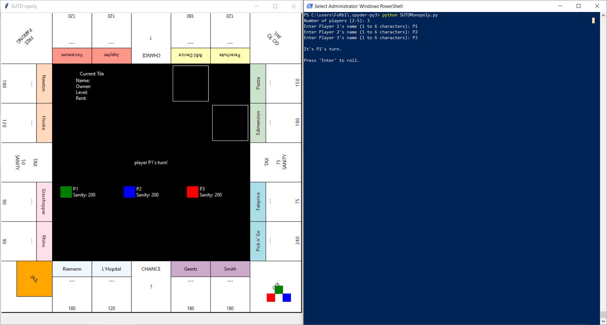

# SUTDMonopoly

## Introduction

**SUTDMonopoly** is a multiplayer text-based game based on the board game "Monopoly". It operates on two windows — one for display, and another for taking user inputs. We adopted and modified most of the original game features (<find citation later>) and incorporated characteristics that are unique to SUTD. 

The rules in this variant are similar to "Monopoly". As with Monopoly, this game is meant to be a multiplayer game played between 2 to 5 players. For each turn, the players will roll **2** dices to move their pieces around the board. Upon landing on different tile sets, there will be different events for the users. The objective of the game still holds, which is to force opponents into bankruptcy by buying and upgrading their properties. 

### Rules

The game is played on a 7x7 grid and between 2 to 5 players which is selectable when the game first starts. Each player starts with an initial amount of 200 Sanity. Two dice will be thrown and their pieces will be moved anti-clockwise around the board from the "Home" tile according to the sum of the dice thrown. If the player rolls a double, he will be awarded an additional turn, this condition is repeatable up to a maximum of two extra turns. Every time player passes “Home”, he/she will receive an additional 150 sanity.

Upon landing on an unclaimed property tile, they can choose to purchase the property for a predetermined amount of "Sanity". Any subsequent players landing on this tile will have to transfer a predetermined amount of "Sanity" to the owner of the tile. In the case when the owner lands on his own property, he would be allowed to upgrade the building up to a level of 3.
 
Upon landing on a chance tile, the player will automatically draw a chance card that will have random positive or negative effects. Upon landing on a "Tax" tile, the player would be required to pay the stipulated tax associated to it. Landing on the "Go To Jail" tile will cause the player to be jailed for his next 3 turns.

Players who have lost all their sanity and have no more properties as mortgage will be labelled as bankrupt and their turns will be skipped.

The game ends when all other players, except the winner, turns “crazy for studying too hard’, i.e., lost all their ‘Sanity’

### Properties

In this variant of Monopoly, properties are coded to be in sets of 2. For the sake of simplicity and gameplay, ownership of properties from the same set would not automatically increase its base rent. There are a total of 16 buildings scattered around the board. Each property has three levels and landing on a property you own will allow you to upgrade it should you have enough sanity. The sanity that players who land on your property have to pay will be a function of the level of your building and your building’s sanity cost with which you have upgraded it.

### Mortgage

If a player lands on another player’s property and does not have enough sanity to pay the rent, he may sell any of the buildings he owns and use their costs to supplement his rent payment. The building sold by the player would then be possessed by the “landlord”, retaining its level. The player would be asked to sell his buildings repeatedly in a while loop until he has compensated more than or equal to his pending rent payment. If the sum of his buildings’ costs are not sufficient to pay for the rent, all his buildings would be possessed by the landlord and he would be bankrupted.

The mortgage system also applies when players do not have enough sanity to pay for chance cards and tax, when the player’s sold buildings would be repossessed by the board and free for others to purchase and own.

### Chance

In this variant of Monopoly, there will be a total of 20 chance cards, with 4 primary effects such as gaining "sanity", "losing "sanity", going to jail, and losing a property. The chance cards will be drawn by deck and will not be repeated until the deck is fully depleted, which then, it will be reshuffled.

### Jail

If jailed, the player will be jailed for his next 3 turns. A player would also have the chance to break out of jail early if he manages to roll a double during his turn.

### Tax

There are 2 tax tiles around the board with penalties of 50 and 75 sanity respectively. Any player who lands on these tiles will have to pay the amounts stipulated. 

### Winning condition

As with Monopoly, players are allowed to sell their properties to stay "Alive" and continue playing the game. However, the players are eliminated when they run out of currency, "Sanity" and properties to sell. The game ends when all other players, except the winner, turns “crazy for studying too hard’, i.e., lost all their ‘Sanity’. The winner will be announced in text and the terminal exits after entering 'end'.

### Dependencies:

- tkinter
- random

## How to play

1. Ensure that your python is of at least version 3.8 for tkinter to work.

2. Open power shell (Win X + A) or any of your favorite terminal or Anaconda Prompt.

   ```bash
   # Move to the project directory.
   $ cd </project/folder>
   # Run the game.
   $ python ./SUTDMonopoly.py
   ```
   
3. Upon launching the game, set the terminal to be on the right side of your screen and the tkinter window to be on the right side of the screen. The game should look something like this


   
## Documentation

### class player(name: str)
Player class to keep track of each players in the game.

**Properties:**

- **name** – Player's name in string.
- **status** – Player's status in string, defaulted at "Normal".
- **position** – Player's position in integer.
- **sanity** – Player's sanity in integer, defaulted at 200.
- **jail_count** – Player's jail_count in integer.

### teleport(position: int)
> Changes the player position to the stipulated input.

### update_jailCount()
> Reduces player's jail_count until reaches 0, and changes player's status back to "Normal".

### update_position(step: int)
> Modifies the player's position attribute and modulus to keep within scale of num_of_tiles.


### class building(name: str, truncated: str, cost: list(int, int, int))
Building class to keep track of each building in the game.

**Properties:**

- **level** – Building's level in integer, defaulted at 0.
- **owner** – Building's owner in integer, defaulted at None.
- **cost** – List of length 3 of Building's costs.
- **name** – Building's name in string.
- **truncated** – Building's truncated/shortened name in string.

### get_rent()
> Returns an integer, that is 1.5x of the building's current level's cost.

### get_cost()
> Returns an integer, that is the summation of all the building costs up till the building's current level.


### class tile(tile_type: str, building: object)
Tile class to keep track of each tile in the game.

**Properties:**

- **tile_type** – Tile's type_type in string.
- **building** – Building object associated with the tile.


### class card(name: str, effect: str, cost: int)
Card class to keep track of each chance card in the game.

**Properties:**

- **name** – Card's name in string.
- **effect** – Card's effect and cost in a tuple. 

### Game Functions
These functions are used for the game logic and to progress the game.

#### roll()
> Randomizes 2 integers ranging from 1 to 6.

**Returns:** A tuple of the two randomized integers.

#### home(player_id: int)
> Modifies the player's sanity when the player passes go.

**Returns:** None

#### jail(player_id: int)
> Teleports the player to jail when necessary.

**Returns:** None

#### tax(player_pos: int, player_id: int)
> Modifies the player's sanity depending on the tax cost. 
> Will bankrupt the player if insufficient sanity.

**Returns:** None

#### chance(player_id: int)
> Randomizes player event depending on the chance card drawn.

**Possible events:**
1. update_sanity
2. sanity for all
3. birthday
4. go to jail
5. roll double
6. lose a property

**Returns:** None

#### pay_rent(from_player: int, to_player: int, amount: int)
> Transfers player sanity from one player to another
> Possibility to bankrupt the player and transfer a property instead.

**Returns:** None

#### upgrade_building(active_building: object, player: object)
> Modifies the active_building object's level attribute depending on user's input.

**Returns:** None

#### buy_building(player: object, player_id: int, active_building: object)
> Modifies the active_building object's owner attribute depending on user's input.

**Returns:** None

#### bankrupt(amount: int, from_player: int, to_player: int)
> Gathers from_player list of buildings and transfer to to_player until amount reaches 0

**Returns:** None

#### gameround(player_id: int)
> Facilitates the current player's actions and calls upon other functions depending on situation.

**Returns:** None

#### game()
> Facilitates the player's turns and rotate them accordingly to the active players.

**Returns:** None

#### render_game()
> Initializes the game's information just before the beginning of the game.

**Returns:** None

### UI Functions
These functions help translate the game data in the program to graphics in the Tk() window.

#### avg( CoordLs: [x1,y1,x2,y2], xy: str)
> Finds the average of x or y coordinates of two extreme corners of a rectangle in the User Interface (UI) dpending on the value of xy

**Parameters**:
* **CoordLs**— a list of values corresponding to the coordinates of the top left corner (x1, y1) and bottom right corner (x2, y2) of a rectangle in the UI
* **xy**— a string containing 'x' or 'y'

**Returns:** The mean of x1 and x2, or y1 and y2, depending on whether the value **xy** passed was 'x' or 'y' respectively

#### getProperties(coord: [x1,y1,x2,y2], ori: int or str, thisId: int)
>  Returns several key coordinates and rotation angles for the components of the tile with the coordinates represented in **coord**

**Parameters**:
* **coord**— a list of values corresponding to the coordinates of the top left corner (x1, y1) and bottom right corner (x2, y2) of a rectangle in the UI representing a tile on the board
* **ori**— an index corresponding to the rotation of the tile, or a string to indicate that it is a corner
* **thisId**— the integer ID of the rectangle assigned by the tkinter.Canvas() object

**Returns:** A tuple with contents: (thisId, smolBox, centre, bottom, namePos, ownerPos, textRot)
* **thisId**— the integer ID of the rectangle assigned by the tkinter.Canvas() object
* **smolbox**— a list of values corresponding to the coordinates of the top left corner (x1, y1) and bottom right corner (x2, y2) of the small coloured rectangle located at the top of the tile for rectangluar tiles, and those of a square occupying the top right corner of the tile for corner tiles
* **centre**— a list containing the x and y value of the centre of the tile
* **namePos**— a list containing the x and y value to which the text object displaying "chance" or property name will be anchored to on a rectangular tile
* **ownerPos**— a list containing the x and y value to which the text object displaying the owner of the property will be anchored to on a property tile
* **textRot**— the angle (in degrees) at which the text objects should be rotated

#### setDice(roll: int, pips: list())
> Changes the state of the seven pips (tkinter.canvas oval objects) in one of the displayed dice on the UI to display the number rolled by the player. Setting the oval object's state to tkinter.DISABLED turns it black, causing it to "disappear" against the black background, while setting the object's state to tkinter.NORMAL causes it to turn white. 

**Parameters**:
* **roll**— the number rolled by the player
* **pips**— a list containing all the IDs assigned to each oval object in the tkinter.Canvas() object representing a pip 

**Returns:** None

#### initUI()
> Initialises the UI. Instantiates the canvas, tiles, dice, player tokens, various text objects and reflects the initial state of the board and player sanity count

**Returns:** None

#### update_UI(\*args)
> Updates the UI with the latest game information. If supplied with optional parameters, will also update player turn, dice rolls and the name of any property the active player has landed on

**Parameters:**
* **\*args**— accepts up to 3 arguments, **player_id**, **dice1** and **dice2**, and reflects the current property tile and current player's turn on the UI, and updated dice roll,  respectively

**Returns:** None

Special thanks to Tim for not sleeping and CS for raging during debugging.
